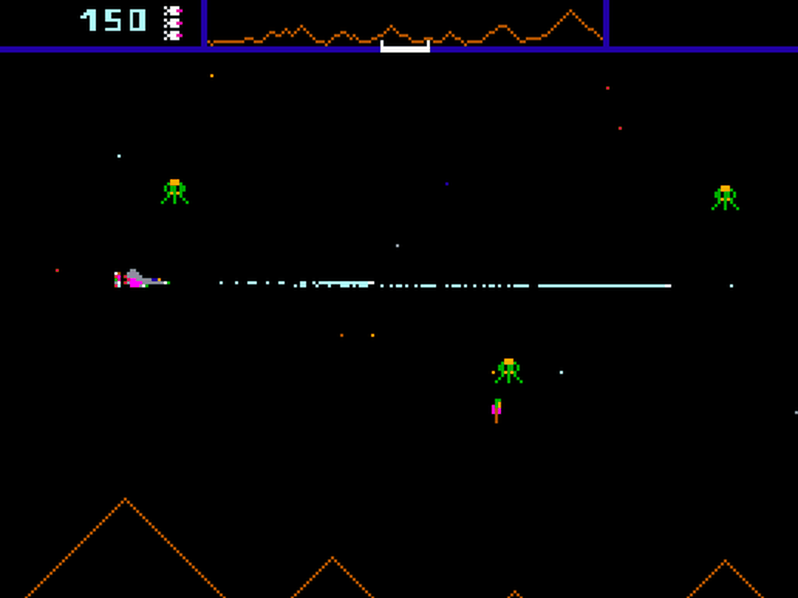
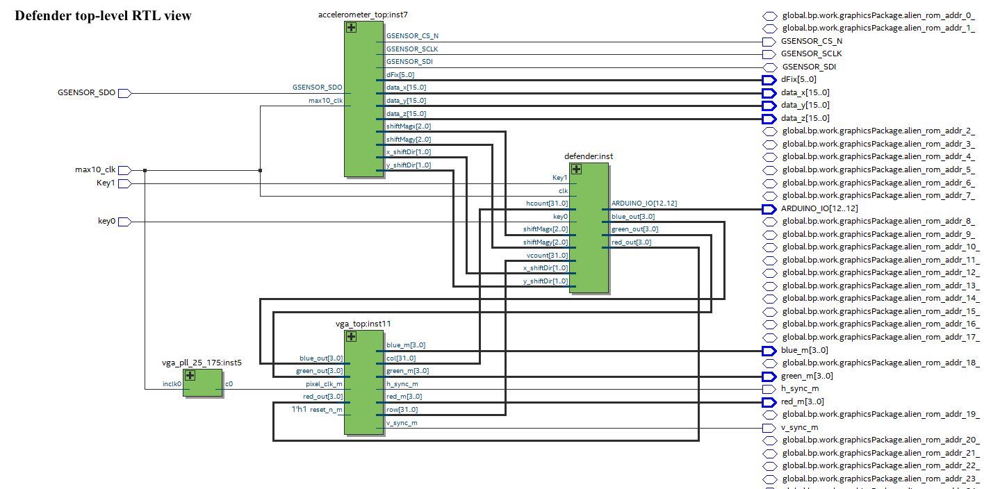
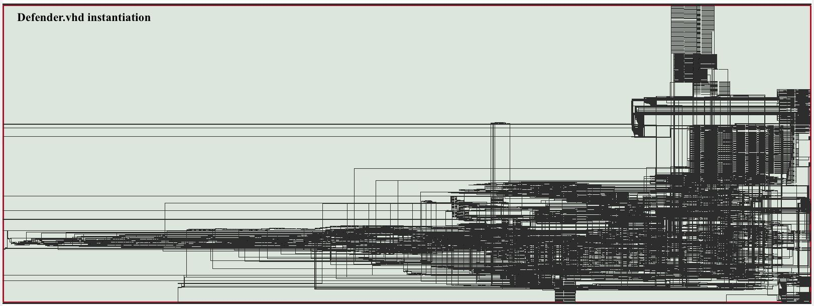

### Defender (1981 video game) - VHDL FPGA implementation for Digital Systems Design

Original game:

[Defender](https://en.wikipedia.org/wiki/Defender_(1981_video_game)) is a scrolling shooter video game developed by Williams Electronics in 1980 and released for arcades in 1981. [Defender](https://en.wikipedia.org/wiki/Defender_(1981_video_game)) was one of the most important titles of the golden age of arcade video games, selling over 55,000 units to become the company's best-selling game and one of the highest-grossing arcade games ever. Praise among critics focused on the game's audio-visuals and gameplay.

This is a recreation of the famous video game from the "golden era" of gaming. It was written in VHDL using Quartus for the DE-10 Lite Development board. 

The DE-10 Lite board from Intel includes a VGA connector and this was used for video output for the gameplay. This is a recreation of the original game completed as the final project for digital system design, a course at my university.

#### RTL View

#### RTL Instantiation

