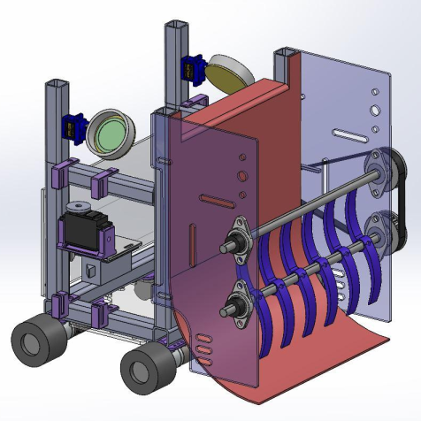
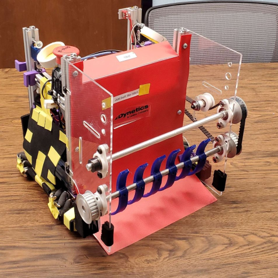

### SoutheastCon Hardware Robotics Competition

The goal of this project was to design and fabricate an autonomous robot to compete in the 2023 IEEE SoutheastCon Hardware Competition. The finalized design needed to both complete specified objectives and comply with constraints outlined in a set of rules and regulations provided by the competition organizers. The completed robot placed 4th overall out of 36 registered teams. More detail can be provided for this project on request. 
Final project poster available [here](files/Poster.pdf).

The Project GitHub is public and stores the project proposal, conceptual design, and detailed design. The GitHub is linked [here](https://github.com/nathan-gardner/SECON2023Robot).

#### Images:

Robot CAD Model                      |  Final Robot
:-----------------------------------:|:-----------------------------------:
  |  
